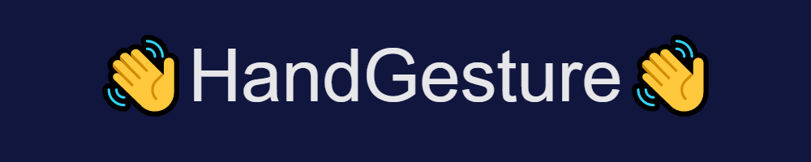

## Description and Objective

This is our fourth year computer engineering capstone project from Ryerson / TMU. The goal of the capstone was to implement a hardware + software solution recognize gestures. It was decided to use a combination of arduino and python to create a system that can read sign language and output the correct gesture made. Arduino is responisble for reading the sensors attached to the glove and sending the information to a python script via serial. The python script was to then parse the data and read it as input to a machine learning model, which then predicts the gesture made. The model itself is trained using data collected before hand.


---
## Materials Needed
Certain items such as the velcro or wires you will needed to purchase depending on how you set up the project. For the materials it is important to make sure the flex sensors are good quality otherwise the data retrieved may be poor.
| Item | Quantity |
| ------ | ------ |
|Arduino MEGA (alternative: UNO) | 1 |
|Mini Breadboard |1|
|Accelerometer + Gyroscope [MPU 6050] |1|
|Glove |1|
|Soldering Kit |1|
|Velcro |2|
|47 kΩ Resistors |5|
|Flex Sensor |5|

## Sofware Tools and Libraries
### Arduino
| Software | Description |
| ------ | ------ |
|Arduino IDE | You can use other IDEs but the one made for arduino is the simplest |
|<Wire.h> |This library for arduino helps with reading Accelerometer and Gyroscope values|

### Python
| Software | Description |
| ------ | ------ |
|VS Code | or any other IDE/text edditor you prefer |
|numpy | combine different data and modify them|
|pandas| to read csv files and store them in arrays |
|sklearn| This is our main library to work with Machine Learning. We will be using the random forrest classifier|
---
# Procedure
To make sure all circuitry is correctly placed, you can design and use a PCB, otherwise you can use a breadboard or direct connection. Also make sure all connections are working and ready before attaching components to the glove.

The following is how flexsensors are connected. This way you are able to read the flexsensor values based on the bending of the glove.


The full circuit will look like this.


Once attached make sure the arduino code is uploaded. Then make sure all data is being read properly and also sent in the proper syntax. The data should look like this:


If all is working fine you can proceed to attaching the components to the glove. Using the glove and the portion of the arduino code that is commented, you can start and stop recording data. Use this to record data for any gesture you like or use our premade data. However because of different flexsensors or different glove size, the premade data may not work well with your set of equipment. After recording you may recomment the code. The glove is ready to predict gestures, run the arduino code and then the python code, you should start to see the predicted gesture.

### Code Explanation - Arduino
The Arduino code is self explanatory for the  most part. You set up the variables and pins for reading as well as the port for transmission. To record the data for each gesture the following was used:


To read the flex sensors is simple but reading the gyroscope was done by doing this:


The following is used to delay the input reading, This also makes the intervals for data reading more concistent
```arduino
delay(100);
    Serial.flush();
  }
```
### Code Explanation - Python
The data for the machine learning model was set up first. This was done by reading the CSV files as arrays and then merging all the data to a single data array.


Then an array of equal size was created for the labels of each alphabet.


This is a simple function used by our program that converts the numeric label prediction into alphabets for us to read
```python
def num2str(i):
        alpha = "ABCDEFGHIJKLMNOPQRSTUVWXYZ"
        return alpha[i]
```

The main portion of our code. This deals with creating and training the prediction model. Handles any connection errors or parsing errors. Parses data so that it is compatible with our model and finally prints out the prediction.


---

## Results
To compare our results we had a set of hardcoded / brute force approach of predicting the gestures. This was to give the results something to compare to as well as validate why using machine learning is the correct approach when it comes to predicting.
**Machine Learning**


**Brute Force / Hard Code**


Final thoughts:
- The results could be better, this was due to poor data for the trained model as well as small quantity of data
- The results of the confusion matrix showed that ML is a better approach, however I realize the comparison was not fair since better code could have been produced for the brute force approach
- Better flexsensors would yeild much better results. The flexsensors we had were poor quality and the data would have huge fluctuations, whereas better sensors would produce gradual change in values
- Our code did not properly make use of the accelerometer, this would yeild better results. We only used the gyroscope portion which gives us partial data about the gesture being made.

---
## References

1. Mantelli, A. (2021). Learning Japanese through VR technology. the case of Altspace VR. 57 | 2021, 57(1). https://doi.org/10.30687/annor/2385-3042/2021/01/024

2. Berget, J. (2017, November 22). Sign Language Should be Taught in Schools. The Other Press. Retrieved November 30, 2021, from https://theotherpress.ca/sign-language-should-be-taught-in-schools/.

3. Monica Lin, R. V. (n.d.). Sign language glove. ECE 4760 Sign Language Glove. Retrieved from https://people.ece.cornell.edu/land/courses/ece4760/FinalProjects/f2014/rdv28_mjl256/webpage/ 

4. Schoeffler, M. (2021, January 6). Tutorial: How to use the GY-521 module (MPU-6050 Breakout Board) with the arduino uno. Michael Schoeffler. Retrieved April 12, 2022, from https://mschoeffler.com/2017/10/05/tutorial-how-to-use-the-gy-521-module-mpu-6050-breakout-board-with-the-arduino-uno/ 

5. Simone. (2021, October 17). Arduino gesture recognition: The easy way with machine learning. Eloquent Arduino Blog. Retrieved April 12, 2022, from https://eloquentarduino.github.io/2021/10/arduino-gesture-recognition-the-easy-way-with-machine-learning/ 


